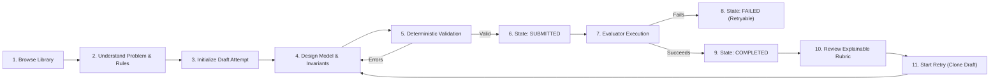
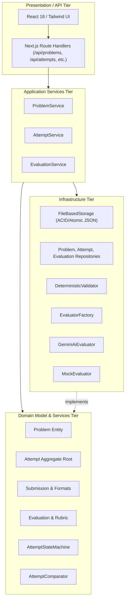

# Low-Level Design (LLD) Platform — Architecture & Domain Design Document

## 1. Product Goal
The objective of this platform is to provide a focused, deliberate practice environment for software engineers preparing for Low-Level Design (LLD) and machine coding evaluations. The system enables learners to select an architectural problem, construct an object-oriented domain model, submit design evidence, validate structural invariants deterministically, receive explainable rubric-based feedback, and iteratively refine their design across attempts.

---

## 2. MVP Scope
The MVP concentrates exclusively on the end-to-end practice loop:
* **Curated Problem Library**: 5 high-yield problems (Parking Lot, Vending Machine, Elevator System, Library Management System, Splitwise).
* **Structured Submission Format**: Assumptions, Core Classes (attributes & methods), Interfaces, Relationships, Workflows, Design Patterns, Extensibility, Edge Cases, and Trade-offs.
* **Deterministic Validation Layer**: Enforces mandatory fields, entity naming, responsibilities, and structural integrity before calling external evaluators.
* **Pluggable Evaluation Layer**: Dual-mode engine supporting Google Gemini AI (`gemini-2.5-flash`) with strict JSON schema outputs and a high-fidelity offline `MockEvaluator` for instant, deterministic demos.
* **Rubric-Based Feedback**: 8 explicit design dimensions evaluated with submitted evidence, identified concerns, actionable suggestions, and confidence scores.
* **Iterative Attempt Lifecycle**: Full state-machine transitions (`DRAFT` → `SUBMITTED` → `EVALUATING` → `COMPLETED` / `FAILED`), comparative analytics between iterations, and non-destructive retry workflows.

---

## 3. The Core Practice Journey



---

## 4. Modular Monolith Architecture

The codebase adheres to Clean Architecture principles with clear separation of concerns across four conceptual tiers:



* **High Cohesion**: All domain invariant logic (lifecycle states, draft validation, score comparison) lives in pure domain entities and services, independent of web frameworks or database engines.
* **Low Coupling & Inversion of Control**: Application services interact strictly through interfaces (`IProblemRepository`, `IAttemptRepository`, `IEvaluationRepository`, `IEvaluator`), allowing infrastructure implementations to be swapped with zero changes to use cases.

---

## 5. Domain Model & Entities

### 1. `Problem`
Represents an immutable problem specification containing:
* `id`, `title`, `shortDescription`, `difficulty` (`BEGINNER` | `INTERMEDIATE` | `ADVANCED`), `estimatedTimeMinutes`
* `statement`, `functionalRequirements`, `businessRules`, `constraints`, `assumptions`, `expectedDesignAreas`, `hints`, `tags`

### 2. `Attempt` (Aggregate Root)
Enforces attempt lifecycle invariants:
* `id`, `problemId`, `attemptNumber`, `status` (`DRAFT`, `SUBMITTED`, `EVALUATING`, `COMPLETED`, `FAILED`)
* `draftContent`, `submission`, `evaluationId`, `errorMessage`, `createdAt`, `updatedAt`, `submittedAt`, `completedAt`
* **Domain Behavior via `AttemptStateMachine`**:
  * `updateDraft()`: Allowed only in `DRAFT`.
  * `submit()`: Freezes submission snapshot, sets status to `SUBMITTED`.
  * `markEvaluating()`: Transitions `SUBMITTED` or `FAILED` to `EVALUATING`. Idempotency guards prevent duplicate evaluations.
  * `completeEvaluation()`: Attaches evaluation ID, marks `COMPLETED`.
  * `failEvaluation()`: Records error message, preserves submission snapshot, marks `FAILED`.

### 3. `Submission`
Represents the evaluated snapshot of learner design evidence:
* Generic `ISubmission<T>` container with `format: SubmissionFormat`
* `StructuredTextSubmissionContent`:
  * `assumptions`: string
  * `classes`: `ClassEntity[]` (name, responsibility, attributes, methods)
  * `interfaces`: `InterfaceEntity[]` (name, responsibility, methods, rationale)
  * `relationships`: `Relationship[]` (from, to, type, explanation)
  * `workflows`: `Workflow[]` (name, steps)
  * `designPatterns`: `DesignPatternUsage[]` (pattern, appliedTo, rationale)
  * `extensibility`: string
  * `edgeCases`: string
  * `explanation`: string

### 4. `Evaluation` & `Rubric`
Represents the structured assessment generated against the fixed rubric:
* `overallScore`: 0–100 (weighted sum of criterion scores)
* `summary`: 2–3 sentence executive architectural review
* `criteria`: Array of 8 criterion evaluations, each specifying:
  * `criterionKey`, `name`, `score`, `evidence`, `concern`, `suggestion`, `confidence`
* `strengths`, `improvements`, `nextPracticeFocus`, `confidence`, `evaluatorType`

---

## 6. Key Abstractions & Extension Points

### Evaluator Abstraction (`IEvaluator`)
```typescript
export interface EvaluationContext {
  problem: Problem;
  submission: Submission;
  rubric: Rubric;
}

export interface IEvaluator {
  readonly type: EvaluatorType;
  evaluate(context: EvaluationContext): Promise<Evaluation>;
}
```

### Submission Format Abstraction (`ISubmission`)
```typescript
export type SubmissionFormat = "STRUCTURED_TEXT" | "CLASS_DIAGRAM" | "CODE";

export interface ISubmission<T = any> {
  id: string;
  attemptId: string;
  format: SubmissionFormat;
  content: T;
  submittedAt: string;
}
```

---

## 7. Deterministic Validation vs. AI Evaluation

We deliberately separate validation into two tiers:
1. **Deterministic Validator (`DeterministicValidator.ts`)**:
   * Runs locally in $O(N)$ execution time with 0 network latency.
   * Validates that required fields exist, at least one entity is defined, class responsibilities meet minimum depth, overall trade-off explanation is present, and attempt status is valid.
   * Emits blocking errors (HTTP 422) and non-blocking advisory warnings (e.g. missing interfaces or assumptions).
2. **Evaluator (`IEvaluator`)**:
   * Invoked only after deterministic validation passes.
   * Focuses purely on architectural reasoning, coupling/cohesion assessment, pattern justification, and evidence synthesis.

---

## 8. Failure Handling & Concurrency Idempotency

* **Slow AI / Async Flow**: The system immediately commits the submitted snapshot, transitions the attempt to `EVALUATING`, and responds. The client UI displays an asynchronous progress loader with automatic polling.
* **Evaluation Failure**: If the LLM call times out, returns malformed JSON, or exceeds rate limits, `AttemptStateMachine.failEvaluation()` records the error, transitions the attempt to `FAILED`, but strictly preserves the submission data. The user can trigger a 1-click re-evaluation without re-entering their design.
* **Duplicate Evaluation Prevention**: An attempt in `EVALUATING` or `COMPLETED` cannot be evaluated twice. The service layer verifies the state machine transition before issuing an evaluator call.

---

## 9. Extensibility: Change Tests

### Change Test A: Introducing Class Diagram Submissions
* **Scenario**: The product team introduces visual class diagram submission (e.g. Mermaid or JSON node-graph) alongside structured text.
* **What Changes**:
  1. Add a new submission format type: `format: "CLASS_DIAGRAM"`.
  2. Implement a new content interface `ClassDiagramContent` (nodes, edges, annotations).
  3. Create a diagram-specific validator `DiagramDeterministicValidator` implementing the shared validation contract.
  4. Update the UI with an interactive canvas / graph editor component.
* **What Remains Unaltered**:
  * `Attempt` aggregate and lifecycle state machine remain 100% identical.
  * `AttemptService`, `EvaluationService`, and persistence repositories require zero modifications.
  * The feedback page, history timeline, and comparison engine continue functioning seamlessly.

### Change Test B: Introducing Rule-Based or Human Evaluators
* **Scenario**: Adding an offline static analysis evaluator (`RuleBasedEvaluator`) or an asynchronous expert review queue (`HumanEvaluator`).
* **What Changes**:
  1. Implement `IEvaluator`:
     ```typescript
     export class RuleBasedEvaluator implements IEvaluator {
       readonly type = "RULE_BASED";
       async evaluate(context: EvaluationContext): Promise<Evaluation> { ... }
     }
     ```
  2. Register the evaluator in `EvaluatorFactory.ts`.
* **What Remains Unaltered**:
  * `EvaluationService` calls `evaluator.evaluate(context)` identically.
  * Persistence schema, database models, attempt states, and feedback UI components require zero rewrites.

---

## 10. Scalability & Evolution Path
* **Current MVP**: Modular monolith with in-process application services and ACID file-based JSON persistence.
* **Step 1 (Moderate Scale - 10k users)**: Swap `FileBasedStorage` with PostgreSQL / SQLite using Prisma or Drizzle by providing repository implementations for `IProblemRepository`, `IAttemptRepository`, and `IEvaluationRepository`. Zero domain or controller code changes.
* **Step 2 (High Concurrency - 100k+ evaluations)**: Decouple evaluation execution behind a lightweight queue (e.g. BullMQ / Redis). The controller returns `202 Accepted`, workers pull jobs and invoke `IEvaluator`, and WebSockets notify the client upon completion.

---

## 11. Key Engineering Trade-offs

| Decision | Alternative Considered | Chosen Approach | Rationale |
| :--- | :--- | :--- | :--- |
| **Structured Text over Free-form Text** | Single large textarea | Structured sections (Classes, Interfaces, Relationships, Workflows) | Guided inputs reduce cognitive load, yield 10x more consistent evaluations, and prevent unstructured prompt drift. |
| **Atomic File Repository over External DB** | PostgreSQL / Docker container | Pure Node/TS Atomic File Repository (`.data/*.json`) | Zero external infrastructure dependencies or Docker requirements; 100% portable across Windows/macOS/Linux; instant setup for interviewers. |
| **Direct REST Call over Heavy SDK** | `@google/genai` or third-party wrappers | Native REST `fetch` with strict JSON schema configuration | Eliminates transitive native dependency conflicts, guarantees minimal bundle size, and ensures robust compatibility across Node versions. |
| **Dual Evaluator Modes (Gemini + Mock)** | Gemini API only | Factory providing both `GeminiAiEvaluator` and `MockEvaluator` | Guarantees that any evaluator or interviewer can test the full practice loop offline immediately without requiring an API key. |
